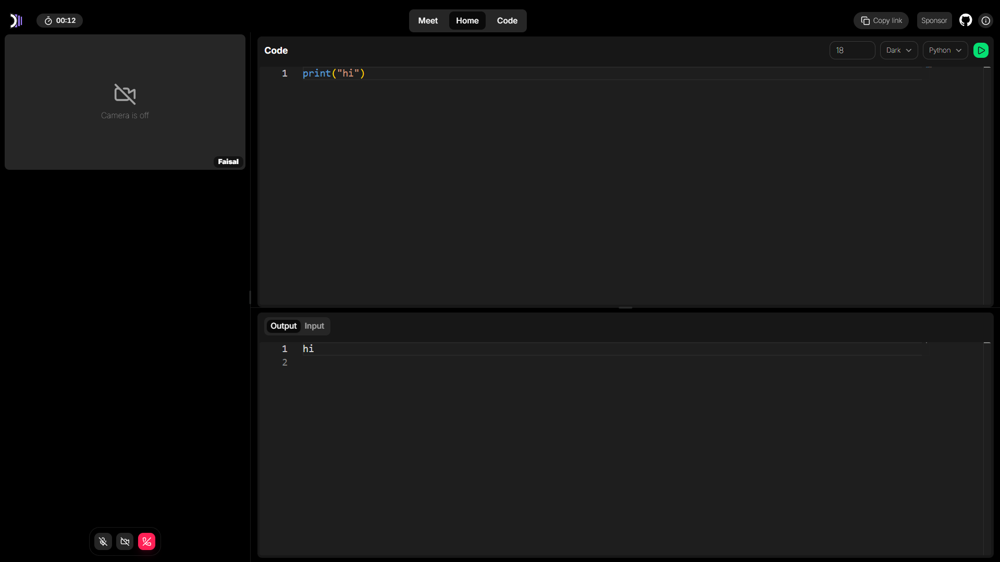

# Dev Meet

<p align="center"><b>A coding interview platform that ships an IDE, so you never have to code in a Google Doc again.</b></p>

Tired of interviewing candidates over Zoom/Google Meet with nowhere to write code? Dev Meet runs your entire technical interview in one room: face-to-face video, a real-time shared Monaco editor, and a built-in compiler — without leaving the tab.

[Live Application](https://devmeet.faisalsaifi.com)

## Preview



## Features

- **Instant rooms** — create a meet with one click and share a simple invite link; each room is capped at 2 members.
- **Live shared editor** — a full Monaco (VS Code) editor where both sides type together in real time, with remote cursors, selections, and persisted code per language using Yjs.
- **Built-in compiler** — run your code against stdin and see stdout/stderr/compilation output, all inside the interview (Judge0 backend).
- **Multiple languages** — C++, C, Java, and Python with syntax highlighting, switchable per room.
- **Peer-to-peer video** — WebRTC audio/video call over `simple-peer`, with mic/camera toggles, live preview before you join, and remote mic/camera indicators.
- **Interview ergonomics** — resizable video/editor splits, editor light/dark themes, adjustable font size, `Ctrl/Cmd + Enter` to run, and an in-app first-run guide.

## How it works

1. Click **Start a Meeting Now** and enter your name.
2. Copy the invite link and share it — the other person opens it and joins the same room.
3. Accept the invitation to join the call.
4. Start coding. Voila 🎉

## Tech stack

- **Framework**: Next.js 16 + React 19 + TypeScript, served by a custom Node server (`tsx server.ts`)
- **Editor**: Monaco Editor + `@hocuspocus/provider` + `y-monaco` for shared editing
- **Realtime sync**: Yjs over Hocuspocus (WebSocket `/collab`)
- **Signaling & events**: Socket.IO
- **Video/audio**: WebRTC via `simple-peer`
- **Compiler**: Judge0 CE via the RapidAPI endpoint (`/api/compile`)
- **UI**: Tailwind CSS 4, shadcn/ui, `motion`, `sonner`

## Getting started

### Prerequisites

- Node.js 20+ (22 recommended)
- [pnpm](https://pnpm.io/) 10+

### Setup

```bash
pnpm install
```

Copy the environment template and add your Judge0/RapidAPI key (needed for the Run button):

```bash
cp .env.example .env.local
```

### Scripts

| Command           | Description                                  |
| ----------------- | -------------------------------------------- |
| `pnpm run dev`    | Start the dev server (custom Node server)    |
| `pnpm run build`  | Build the Next.js production bundle          |
| `pnpm run start`  | Run the production server                    |
| `pnpm run lint`   | Run ESLint                                   |

> The `dev`/`start` scripts boot the custom server that wires up Next.js, Socket.IO, and the Hocuspocus collaboration WebSocket, so always use those for a functional app. Serving `:3000` (override with `PORT`/`HOST`).

### Environment variables

| Variable                | Required | Description                               |
| ----------------------- | -------- | ----------------------------------------- |
| `JUDGE0_API_KEY`        | Yes*     | RapidAPI key for the Judge0 CE compiler. Falls back to `NEXT_PUBLIC_API_KEY`. |

## Deployment

The repo includes a [Render blueprint](render.yaml) — free web service, Node 22, `pnpm install && pnpm build`, then `pnpm start` with a `/api/health` health check. The live app runs at `https://devmeet.faisalsaifi.com`.

## Project structure

```
app/api/             Next.js API routes (compile, health)
app/meet/            Room route + NameGate flow
components/site/     Landing page sections
components/          Meet UI (video, options, compiler, nav, notifications)
lib/                 Name/media/room helpers, Monaco setup
workers/             Monaco editor worker
server.ts            Custom server: Next + Socket.IO + Hocuspocus WS
```

## License

[MIT](LICENSE.md)